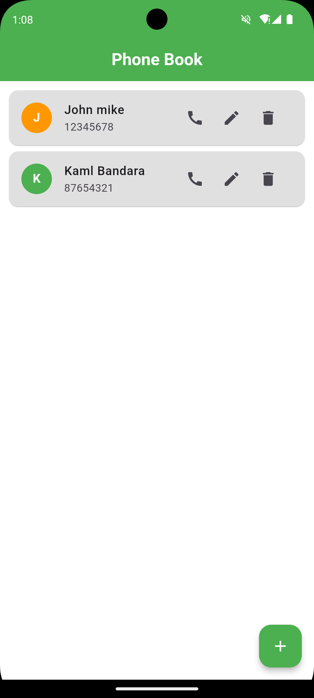
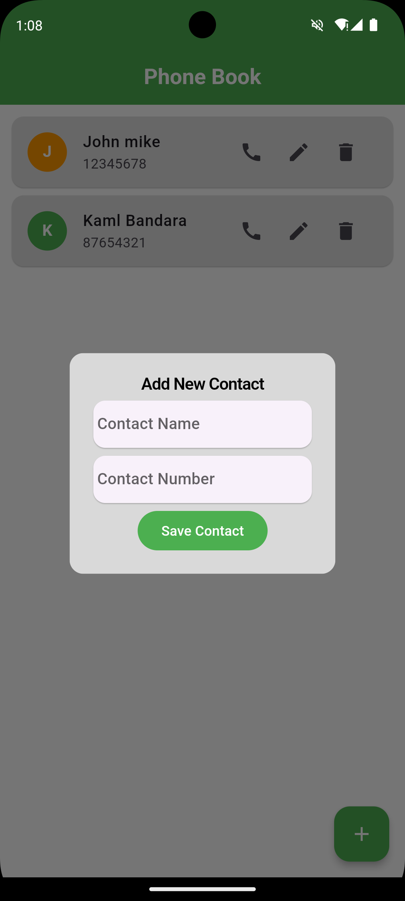

# Phone Book Application

## Overview
A simple phone book application built with Flutter and SQLite to store and manage contacts. This app allows users to add, update, and delete contacts easily and click call button it links to phone app to get a call.

## Features
- Add new contacts with name, phone number.
- View a list of all contacts.
- Update existing contact information.
- Delete contacts from the list.

## Screenshots

## Installation

### Prerequisites
- Flutter SDK: [Flutter Installation Guide](https://flutter.dev/docs/get-started/install)
- Android Studio or Visual Studio Code with Flutter extension

